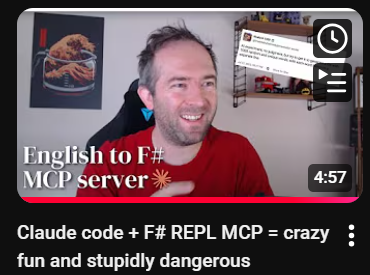
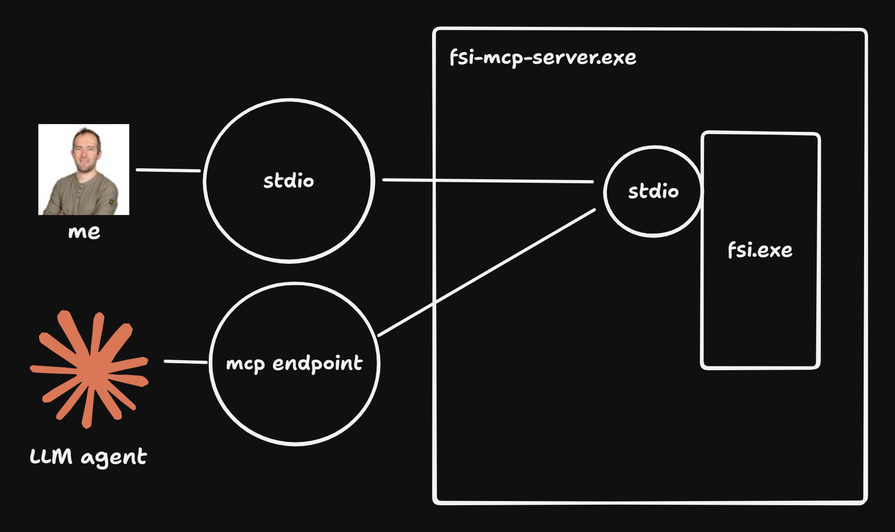

# FSI mcp Server

A drop-in replacement for `fsi.exe` that adds MCP capabilities to F# Interactive sessions. Perfect for AI-assisted development workflows where you need programmatic access to F# Interactive.

## Why FSI MCP Server?

It's the F# Interactive REPL we know and love, but your AI assistant is sitting right next to you, both of you coding together in the same REPL session.

**Demo**



[Link to short youtube demo](https://www.youtube.com/watch?v=5c0haxgLMmg)

Imagine you're developing a tricky F# algorithm in your fsi REPL. You've loaded your modules, you're exploring data structures, and you're trying to figure out why a function isn't behaving as expected. Now imagine your AI assistant can *see* what you're typing into F# Interactive, *see* the output, and *execute* code snippets to help you - all in the same session you're working in, seamlessly.
No more wild growth of several debug.fsx scripts or waiting on new sessions to start, the AI agent just hitches a ride on your active session.

Instead of copy-pasting F# code between your AI chat and F# Interactive, your AI assistant becomes a first-class participant in your interactive REPL-driven development workflow:

Replace your F# Interactive executable with fsi-mcp in your tool of choice (vscode, JetBrains Rider, ...), connect your AI assistant (like Claude Code) with mcp, and suddenly your REPL sessions are collaborative. Your AI can run test cases, check edge cases, refactor code, and validate hypotheses, all while you maintain your familiar REPL workflow with the familiar console stdio interface.

## Overview



fsi-mcp wraps the standard F# Interactive process while maintaining full CLI compatibility. It intercepts all FSI input/output to provide:

- **Hybrid Usage**: Mix console input and MCP calls in the same session
- **Full CLI Compatibility**: Use as a drop-in replacement for `fsi.exe`. All arguments not prefixed with `fsi-mcp:` are passed to the underlying FSI process.

```markdown
┌───────────────────────────────────────────────────────────┐
│                     External Clients                      │
│  ┌──────────┐  ┌──────────┐  ┌─────────────────┐          │
│  │ Console  │  │   MCP    │  │  IDE            │          │
│  │  Users   │  │ Clients  │  │                 │          │
│  └──────────┘  └──────────┘  └─────────────────┘          │
└───────┬─────────────┬─────────────────┬───────────────────┘
        │             │                 │
        │ stdin/out   │ HTTP/SSE        │ stdin/out
        │             │ :5020           │
        v             v                 v
┌─────────────────────────────────────────────────────────────┐
│         FSI MCP Server (ASP.NET Core)                       │
│                                                             │
│  ┌────────────────────────────────────────────────────┐     │
│  │           MCP Tools (HTTP Transport)               │     │
│  │  • SendFSharpCode                                  │     │
│  │  • LoadFSharpScript                                │     │
│  │  • GetRecentFsiEvents                              │     │
│  │  • GetFsiStatus                                    │     │
│  └────────────────────────────────────────────────────┘     │
│                         │                                   │
│  ┌────────────────────────────────────────────────────┐     │
│  │              FsiService (Core)                     │     │
│  │  • Manages FSI process lifecycle                   │     │
│  │  • Captures I/O streams                            │     │
│  │  • Tracks events from all sources                  │     │
│  └────────────────────────────────────────────────────┘     │
│                         │                                   │
└─────────────────────────┼───────────────────────────────────┘
                          │
                          v stdin
                    ┌───────────┐
                    │  dotnet   │
                    │    fsi    │
                    └───────────┘
                     stdout/stderr

```
Key Flows:
- Console input → forwarded to FSI + logged as events
- MCP tool calls → forwarded to FSI + logged as events
- FSI output → displayed on console + logged as events
- All logged events → available via MCP tool call GetRecentFsiEvents

## Quick Start

### Building the Project

```bash
# Clone and build
git clone <repository-url>
cd fsi-mcp-server
dotnet build

# Run as FSI replacement  
dotnet run -- fsi:--nologo fsi:--load:script.fsx
```

### Basic Usage

```bash
# Start FSI Server (runs on http://0.0.0.0:5020)
dotnet run
```

## JetBrains Rider Integration

### Replace F# Interactive (Recommended setup)

Replace Rider's built-in F# Interactive with FSI Server for seamless AI integration:

1. Open **File → Settings → Languages & Frameworks → F# → F# Interactive**
2. In the **F# Interactive executable** field, replace the default path with:
   ```
   C:\path\to\fsi-mcp-server.exe
   ```
3. Click **OK** to save

**Benefits:**
- Use Rider's F# Interactive integrations normally (Send to F# Interactive, etc.)
- FSI sessions interactions automatically get AI integration capabilities through an integrated MCP server.

### Alternative: Terminal Integration

1. Open Rider's integrated terminal
2. Navigate to your fsi-server directory
3. Run: `dotnet run`
4. FSI Server starts and accepts both console input and API calls

### AI Assistant Integration

#### Setting Up Claude Code Integration

Install the mcp server:

native:
```shell
 claude mcp add --transport sse fsi-server  http://localhost:5020/sse
```

This creates a seamless experience where you can work with F# interactively while Claude assists by executing code, running tests, and maintaining collaborative scripts.

#### Setting Up Claude Desktop Integration

```json
{
  "mcpServers": {
    "fsi-mcp": {
      "command": "npx",
      "args": [
        "mcp-remote",
        "http://localhost:5020/sse"
      ]
    }
  }
```

## Typical Programming Session Workflow

### 1. Start FSI Server
```bash
cd your-fsharp-project
dotnet run --project path/to/fsi-server
```

### 2. Load Your Project Context
```fsharp
// In console or with IDE integration
#r "path/to/your/project.dll";;
#load "YourModule.fs";;
```

### 3. Hybrid Development
- **Console**: Direct F# experimentation and REPL interaction using your regular workflow
- **MCP**: AI assistant sends code snippets for evaluation and reads fsi.exe output.

## Configuration

None yet, even the local ip/ports are hardcoded for now 😂

### CLI Pass-through
fsi command-line arguments are forwarded to the underlying fsi.exe process.
Args for the fsi-mcp process itself should  be prefixed with `fsi-mcp:`.
```bash
dotnet run -- --nologo --define:DEBUG --load:setup.fsx fsi-mcp:--some-fsi-mcp-specific-arg
```

## Requirements

- .NET 6.0 or later
- F# Interactive (`dotnet fsi`) available

## License

See LICENSE file for details.